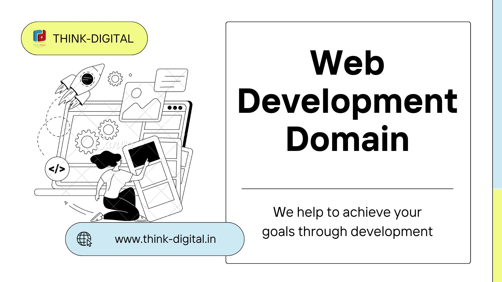

# LinkedIn-Signup-Static-Clone
A static clone of LinkedIn Sign-Up page created during Think-Digital's Web Development Workshop for 2022 recruits.

<p align="center">
  
</p>

**Table of Contents**:

- [Prerequisites](#-prerequisites)
- [Getting Started](#-getting-started)
  - [Cloning this Repo](#clone-this-repo-if-familiar-with-github-and-git)
  - [Downloading ZIP for project](#download-the-zip-file)
  - [Open the project in Browser](#-open-the-project-in-your-browser)
- [Meet the Team](#-meet-the-team)
- [License](#-license)
  - [Forking this project?](#%EF%B8%8F-forking-this-repo)
- [Mentions](#-mentions)

## 🛫 Prerequisites

- A working web browser. (since you're here already, check this off XD)
- A text editor. Any one of the below would do, or whatever you prefer.
  - VS Code - https://code.visualstudio.com/download
  - Atom - https://atom.io/
- Install Git (Optional) - https://git-scm.com/downloads
- Create GitHub account - https://github.com/signup
  
For this project we'll be using the live server extension in VS Code to reload the browser everytime we make some changes during our development phase.

Name: Live Server
Id: ritwickdey.LiveServer
Description: Launch a development local Server with live reload feature for static & dynamic pages
Version: 5.7.9
Publisher: Ritwick Dey
VS Marketplace Link: https://marketplace.visualstudio.com/items?itemName=ritwickdey.LiveServer

## 🚀 Getting Started

### Clone this Repo (If familiar with GitHub and Git)

- Clone the Repository (make sure you've installed [git](https://git-scm.com/downloads) for this). Run the below command in your terminal or command prompt.

```bash
git clone https://github.com/kunalkeshan/LinkedIn-Signup-Static-Clone.git
```

### Download the Zip File

- Click on the `Code` button the middle right side of the page.
- Click on the `Download ZIP` to download a zip folder of the project.


- Extract the folder from the zip download.

## 🕸 Open the project in your Browser.

- Open the `LinkedIn-Signup-Static-Clone` folder.
- Open the `index.html` file in your browser to view the output.
- View code with any text editor of your choice.
- It should be something like this:


## 🤗 Meet the team

| [Appala Sai Surya Varun](https://github.com/v11run) | [Surya Prakash](https://github.com/S-SuryaPrakash) | [Kunal Keshan](https://github.com/kunalkeshan) |
| :---: | :---: | :---: |
|  |  |  |
| Domain Head | Domain Manager | Co-Domain Head |

## 📃 License

This project is licensed under the [MIT License](./LICENSE).

### 🗡️ Forking this Repo?

Many people have contacted us asking if they can use this code for their own websites. The answer to that question is usually "yes", with attribution. There are some cases, such as using this code for a business or something that is greater than a personal project, that we may be less comfortable saying yes to. If in doubt, please don't hesitate to ask us.

We value keeping this project open source, but as you all know, plagiarism is bad. We actively spend a non-negligible amount of effort developing, designing, and trying to perfect this iteration of our project, and we are proud of it! All we ask is to not claim this effort as your own.

So, feel free to fork this repo. If you do, please just give us proper credit by linking back to this repo, https://github.com/kunalkeshan/LinkedIn-Signup-Static-Clone. Refer to this handy [quora] post if you're not sure what to do. Thanks!

## 😇 Mentions

Part of this README and CONTRIBUTING was inspired from https://github.com/monkeytypegame/monkeytype, https://github.com/SneakySensei/react-lean-modal and https://github.com/kunalkeshan/Shiryoku.

---

<p align="center">If you found this project helpful, make sure to drop a 🌟! It helps it become more visible to others.</p>
